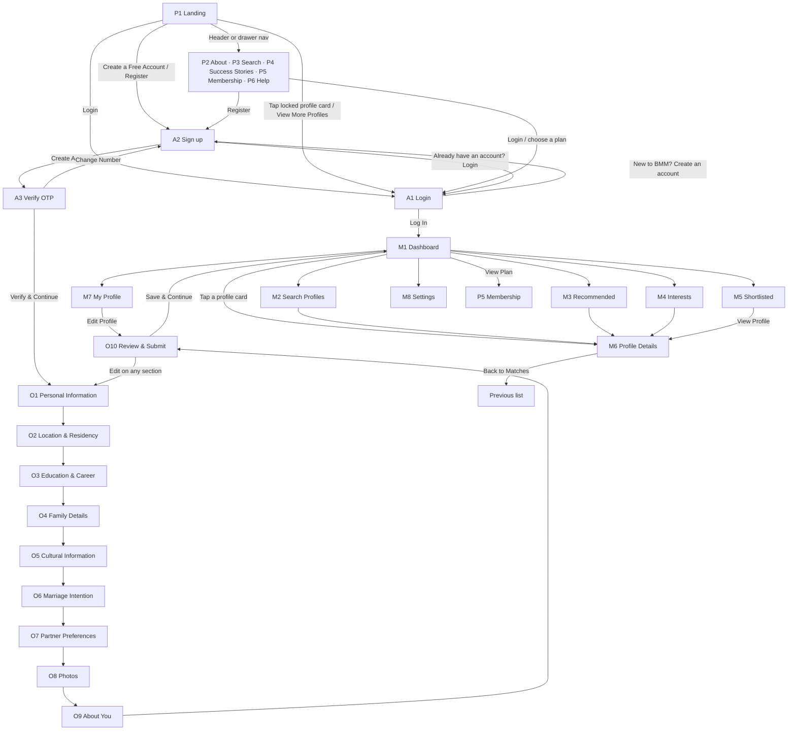

# BMM — Product Requirements Document

**Product:** BMM, a matrimonial platform for Tamil individuals and families in the UK and beyond
**Source of truth:** Figma file `KMca4wAhAG39dWD7iUJTTY` ("Untitled"), Page 1 — 57 frames (29 mobile at 390 px, 27 desktop at 1440 px, and one loose 300 px card)
**Figma link pattern:** `https://www.figma.com/design/KMca4wAhAG39dWD7iUJTTY/Untitled?node-id=<frame id with ":" replaced by "-">`
**Document date:** 6 October 2026

### How to read this document

- Everything in sections 1–8 describes what is **drawn in the Figma file**. Screen text is quoted exactly as designed, except where a typo is corrected (all corrections are listed in section 11).
- Where the design is silent or contradicts itself, the item is marked **[Open]** and collected in section 10. Nothing marked [Open] should be built without a decision.
- Where the prototype links in Figma disagree with the obvious intent, this document states the intended behaviour and records the prototype's link in section 10.3.
- Each screen has an ID (P = public, A = auth, O = onboarding, M = member) used throughout.

---

## 1. Product summary

BMM lets a person create a detailed matrimonial profile, get verified, and find and connect with compatible Tamil matches. Tagline used in the design: **"Same Culture Stronger Together"**. Hero line: **"Find Your Life Partner with BMM"**.

The design is a **responsive web app**: every screen exists at mobile (390 px) and desktop (1440 px) widths, with the exceptions listed in section 10.2.

### 1.1 User states

| State | Who | What they can reach |
|---|---|---|
| **Guest** | Not logged in | Public pages (P1–P7), Login, Sign up. Profile photos on the landing page are shown with a lock icon; tapping a profile sends the guest to Login. |
| **Registering** | Account created and mobile number verified, profile not yet submitted | Onboarding steps O1–O10 only |
| **Member (Free)** | Profile submitted | All member screens (M1–M9) with Free-plan limits |
| **Member (Basic / Premium / Elite)** | Paid plan | Same screens with higher limits (section 7.1) |

### 1.2 Status values shown in the UI

- **Profile Completion** — percentage ring (60% during onboarding, 100% on the dashboard)
- **Verification Status** — "Verified" / not verified; profile cards carry a green "✓ Verified" badge
- **Account Status** checklist on My Profile — Email Verified, Phone Verified, Identity Verified, Profile Approved
- **Online** — green "Online" badge on result cards and "● Online" on profile details
- **Membership Plan** — Free Plan / Basic / Premium / Elite

---

## 2. Screen inventory

| ID | Screen | Mobile frame | Desktop frame | Access | Suggested route |
|---|---|---|---|---|---|
| P1 | Landing (Home) | `1:2` Register - Mobile | `12:235` Register- Desktop | Guest | `/` |
| P2 | About | `136:4767` about- Mobile | `106:1288` about us- Desktop | Guest | `/about` |
| P3 | Public Search | — (not designed) | `106:1586` search page- Desktop | Guest | `/search` |
| P4 | Success Stories | `142:1166` story- Mobile | `109:2185` success story- Desktop | Guest | `/success-stories` |
| P5 | Membership | `156:1429` membership- Mobile | `111:2404` membership- Desktop | Guest + Member | `/membership` |
| P6 | Help | `142:1319` help- Mobile | `111:2628` help- Desktop | Guest + Member | `/help` |
| P7 | Public menu drawer (mobile only) | `147:1533` sidebar- Mobile | — (desktop uses header nav) | Guest | overlay |
| A1 | Login | `114:2882` login - Mobile | `30:492` login- Desktop | Guest | `/login` |
| A2 | Sign up | `120:3115` signup- Mobile | `34:50` reg- Desktop | Guest | `/register` |
| A3 | Verify mobile number (OTP) | `120:3222` otp - Mobile | `34:191` otp- Desktop | Guest | `/verify-otp` |
| O1 | Personal Information | `122:3295` procom - Mobile | `35:346` complete profile- Desktop | Registering | `/onboarding/personal` |
| O2 | Location & Residency | `122:3562` location - Mobile | `38:1114` location- Desktop | Registering | `/onboarding/location` |
| O3 | Education & Career | `122:3418` education - Mobile | `37:886` education- Desktop | Registering | `/onboarding/education` |
| O4 | Family Details | `122:3706` family - Mobile | `38:1317` family- Desktop | Registering | `/onboarding/family` |
| O5 | Cultural Information | `122:3855` culture - Mobile | `38:1516` culture- Desktop | Registering | `/onboarding/culture` |
| O6 | Marriage Intention | `123:892` marriage intention - Mobile | `39:1715` marriage intentions- Desktop | Registering | `/onboarding/marriage` |
| O7 | Partner Preferences | `123:1041` partner prefrence - Mobile | `39:1914` Partner Preferences - Desktop | Registering | `/onboarding/partner` |
| O8 | Photos | `123:1203` photo- Mobile | `39:2138` photos - Desktop | Registering | `/onboarding/photos` |
| O9 | About You | `123:1353` complete- Mobile | `40:2637` about - Desktop | Registering | `/onboarding/about` |
| O10 | Review & Submit | `123:1428` overvieprofile Mobile | `41:2873` review - Desktop | Registering | `/onboarding/review` |
| M1 | Dashboard | `123:1537` dashbaord- Mobile | `45:3112` dashboard - Desktop | Member | `/app/dashboard` |
| M2 | Search Profiles | `130:1741` search- Mobile | `46:3480` search - Desktop | Member | `/app/search` |
| M3 | Recommended Matches | `130:2615` recommendation- Mobile | `50:3952` recommended - Desktop | Member | `/app/recommended` |
| M4 | Interests | `130:2895` intrests- Mobile | `50:4405` intrest - Desktop | Member | `/app/interests` |
| M5 | Shortlisted | `136:4359` shortlist- Mobile | `106:653` short - Desktop | Member | `/app/shortlisted` |
| M6 | Profile Details (another member) | `136:3202` prodetails- Mobile | `57:4759` profile details - Desktop | Member | `/app/profile/:id` |
| M7 | My Profile | `136:3593` my profile 1- Mobile, `136:3817` my profile details- Mobile | `61:5229` (frame is misnamed "shortlisted - Desktop") | Member | `/app/my-profile` |
| M8 | Settings | `136:4003` setting- Mobile | `70:742` setting - Desktop, `70:767` Frame 56 (Notification Preferences card) | Member | `/app/settings` |
| M9 | "More" drawer (mobile only) | `153:1269` more- Mobile | — (desktop uses left sidebar) | Member | overlay |

Routes are suggestions for the build; the design does not define URLs.

---

## 3. End-to-end flow

### 3.1 Master flow

### 3.2 The same flow in words

1. **A guest lands on P1.** From the header (desktop) or the hamburger drawer P7 (mobile) they can open About, Search, Success Stories, Membership, Help, Login or Register.
2. **Sign up (A2):** mobile number + password + confirm password + agree to terms → **Create Account**.
3. **OTP (A3):** enter the 6-digit code sent to that mobile number → **Verify & Continue**.
4. **Onboarding, 10 steps in this fixed order:** Personal Information → Location & Residency → Education & Career → Family Details → Cultural Information → Marriage Intention → Partner Preferences → Photos → About You → Review & Submit. Every step from O2 onward has **Back** (previous step) and **Save & Continue →** (next step). O1 has only Save & Continue.
5. **Review & Submit (O10):** shows a summary of all 9 sections, each with **✎ Edit** that opens that step. **Save & Continue →** submits the profile and opens the **Dashboard (M1)**.
6. **Returning members** log in on A1 and go to the Dashboard. (The prototype sends Log In to the OTP screen — see [Open] 10.1 #1.)
7. **Inside the app** the member moves between Dashboard, Search Profiles, Recommended, Interests, Shortlisted, My Profile and Settings using the left sidebar (desktop) or the bottom navigation + More drawer (mobile).
8. **From any profile card** the member opens Profile Details (M6), where they can **Shortlist** or **Send Interest**, and return with **← Back to Matches**.
9. **My Profile → Edit Profile** opens the Review screen (O10), from which each onboarding step can be reopened and edited.
10. **Dashboard → View Plan** opens Membership (P5).

---

## 4. Global navigation and layout

### 4.1 Public header — desktop (height 80)

Left to right: BMM logo → nav links **Home · About · Search · Success Stories · Membership · Help** (active link underlined in maroon) → globe icon + **UK** + chevron (region selector, [Open] 10.1 #9) → **Login** (outlined button) → **Register** (filled maroon button).

| Element | Goes to |
|---|---|
| Logo / Home | P1 |
| About | P2 |
| Search | P3 |
| Success Stories | P4 |
| Membership | P5 |
| Help | P6 |
| Login | A1 |
| Register | A2 |

### 4.2 Public header — mobile (height 72)

BMM logo on the left, hamburger icon on the right. Hamburger opens **P7**.

**P7 Public menu drawer:** slides in from the right over a dimmed page; close (✕) at top right returns to the previous screen. Contents, top to bottom, centred: logo, **Home** (underlined when active), **About**, **Search**, **Success Stories**, **Membership**, **Help**, globe + **UK** + chevron, **Login** (outlined), **Register** (filled). Destinations are the same as the desktop header. Search → P3, which has no mobile frame yet (the prototype links it to the member search M2 instead).

### 4.3 Public footer (both widths, dark maroon `#65152D`)

White BMM logo · links **About · Privacy · Terms · Help · Contact** · social icons **Facebook, Instagram, YouTube, LinkedIn** · "© 2024 BMM. All rights reserved." Privacy, Terms and Contact pages are not designed ([Open] 10.2).

### 4.4 Member layout — desktop

- **Top bar:** logo · search input "Search by name, profession, location, community..." · **Advanced Search** link with filter icon · bell icon with red unread badge (shows "5") · avatar + first name + chevron (user menu).
- **Left sidebar** (active item has a pink background and maroon text): **Dashboard · Search Profiles · Recommended · Interests · Shortlisted · My Profile · Settings**.
- **Footer:** same as public footer (drawn on Dashboard, Search, Recommended, Shortlisted).

### 4.5 Member layout — mobile

- **Header:** logo + hamburger (same as public; see [Open] 10.1 #10).
- **Bottom navigation, fixed, 5 items** (active item maroon):

| Label | Icon | Goes to |
|---|---|---|
| home | house | M1 Dashboard |
| search | magnifier | M2 Search Profiles |
| Matches | heart | M3 Recommended |
| Interests | paper plane | M4 Interests |
| More | 2×2 squares | M9 More drawer |

- **M9 More drawer:** slides in from the right over a dimmed page, bottom nav stays visible. Items: **Dashboard · Search Profiles · Recommended · Interests · Shortlisted · My Profile · Settings** (active item highlighted pink). Each goes to the matching screen.

---

## 5. Public and auth screens

### P1 — Landing (Home)

**Mobile, top to bottom**

1. Header (4.2).
2. **Hero** over a photo: small tagline "Same Culture Stronger Together" with a short underline; heading **"Find Your Life Partner with BMM"**; text "A trusted matrimonial platform for Tamil individuals and families in the UK and beyond."; button **Create a Free Account →** → A2.
3. **Four feature tiles** (2×2, icon in a circle + label): Verified Profiles · Safe & Secure Platform · Meaningful Connections · Focused on Tamil Community. Not clickable.
4. **Find Your Match** card (search icon, title, filter icon) with four dropdowns and a button:

| Label | Value shown |
|---|---|
| Looking For | Bride |
| Age Range | 25-35 |
| Country | United Kingdom |
| Community | Any |

   Button **Let's Begin** → runs the search (see [Open] 10.1 #4).
5. **"REAL PEOPLE. REAL STORIES." / "Find Matches That Matter"** — horizontally swipeable carousel of profile teaser cards with 3 pagination dots. Card: photo with a **lock icon** in the centre, heart icon top right, green "✓ Verified" badge, then "Priya, 28" / "Software Engineer" / "London, UK" / "Hindu • Tamil". Tapping a card → A1 Login. Button **View More Profiles →** below → A1 Login.
6. **HOW IT WORKS** — four rows, icon + title + line:
   1. Create Your Profile — Quick and easy registration
   2. Get Verified — Build trust in the community
   3. Find Matches — Search and connect
   4. Begin Your Journey — Take the next step towards a brighter future
7. **CTA banner:** "Join Thousands of Tamil Families on BMM" / "A safe, trusted and culturally aligned platform." / **Create a Free Account →** → A2.
8. **Success Stories** — swipeable carousel with 3 dots. Card: round couple photo, quote, "– Aravind & Meena", "London, UK".
9. **Final CTA card:** "Ready to find your perfect match?" / "Create your free account today and start your journey with BMM." / **Get Started Now →** → A2.
10. Footer (4.3).

**Desktop differences**

- Hero is full width with the heading on the left and **Create a Free Account →** → A2.
- The four feature tiles are **not present** on desktop.
- The quick search is a horizontal bar overlapping the bottom of the hero, with two tabs — **Find Your Match** (active, underlined) and **Advanced Search** — then the four dropdowns in one row (labels: "I am looking for", "Age Range", "Country", "Community"; sample age range is "22 - 25") and a **Search Profiles →** button → P3 with those filters applied (see [Open] 10.1 #4).
- Profile teasers show 5 cards in a row (no carousel dots). **View More Profiles →** → A1.
- How It Works is 4 cards in a row; step 4 text is "Start your journey together".
- Success Stories shows 2 cards side by side with different quotes.

### P2 — About

1. **Hero:** eyebrow "ABOUT BMM"; heading "More Than Matches, Meaningful Connections"; paragraph "At BMM, we believe in bringing people together with trust, compatibility and shared values. Our mission is to make your journey to find the right life partner simple, safe and meaningful."; button **Our Story →** → scrolls to the Our Story section (assumed — [Open] 10.1 #16).
2. Line: "Real People. Real Stories. Real Relationships."
3. **Stats row (4):** 50,000+ Verified Members · 10,000+ Successful Matches · 100% Privacy & Security · 4.8/5 Member Satisfaction.
4. **OUR STORY** — "Built on Trust, Driven by People" + two paragraphs (the second, "Today, BMM is home to thousands of like-minded individuals…", appears on desktop only) beside an image, followed by a second **Our Story →** button → P4 Success Stories (assumed — [Open] 10.1 #16).
5. **WHAT MAKES US DIFFERENT** — "A Safer, Smarter Way to Find Your Match" + 4 cards: Verified Profiles ("Authentic and verified members for your safety.") · Personalized Matches ("Smart matching based on your preferences.") · Complete Privacy ("Your data and privacy are always protected.") · fourth card ("We're here to support you at every step." — its title is a duplicate of "Complete Privacy", see 11).
6. **OUR MISSION** — "Helping You Find a Brighter Tomorrow" + paragraph, with **Join BMM Today →** → A2 and the line "Because every great story starts with a match."
7. Footer.

### P3 — Public Search (desktop frame only)

1. Hero: eyebrow "FIND YOUR PERFECT MATCH"; heading "Search for Like-Minded People"; "Discover profiles that match your preferences, values and lifestyle."
2. **Filter panel — 9 dropdowns + button**

| Row 1 | Sample value | Row 2 | Sample value |
|---|---|---|---|
| I am looking for | Bride | Education | Any |
| Age Range | 22 - 25 | Profession | Any |
| Religion | Hindu | Marital Status | Never Married |
| Community | Any | Annual Income | Any |
| Location | Any City | | |

   Button **Search →** applies the filters.
3. **Results bar:** "**2348** Matches Found" on the left; **Sort by** dropdown ("Newest First") and a grid-view toggle on the right.
4. **Result grid:** 5 cards per row. Card: photo, "Online" badge, name + age, profession, location, "religion • mother tongue", buttons **view profile** and **♡ Shortlist**.
5. **Pagination:** ‹ 1 2 3 4 5 … 117 › (current page filled maroon).
6. Footer.

Guest behaviour on **view profile** and **Shortlist** is not drawn — see [Open] 10.1 #5.

### P4 — Success Stories

1. Hero: eyebrow "SUCCESS STORIES"; heading "More Than Matches, Meaningful Connections"; "Real stories of love, trust and new beginnings created on BMM."
2. **Filter tabs** (single-select, horizontally scrollable on mobile): All Stories · Arranged Marriage · Love Marriage · Same Community · Different Community · International · Recent.
3. **Story cards** (6 on desktop, 3 on mobile). Card: couple photo, title "From Profiles to Partners", quote, couple names ("Rahul & Priya"), location ("Ahmedabad, Gujarat").
4. Footer.

No story detail page and no "load more" are drawn.

### P5 — Membership

1. Hero: eyebrow "MEMBERSHIP PLANS"; heading "Find Your Perfect Match with the Right Plan"; paragraph "Choose a plan that fits your journey. Unlock more possibilities, connect with genuine profiles and take a step closer to your happily ever after."
2. **Four plan cards** (4 in a row on desktop, 2×2 on mobile):

| Plan | Line | Price | Period | Per month | Button |
|---|---|---|---|---|---|
| Free Plan | Start your journey with basic access. | ₹0 | Forever Free | — | Get Started (outlined) |
| Basic Plan | Get more visibility and connect easily. | ₹999 | / 3 Months | ₹333 per month | Choose Basic |
| Premium Plan — badge "Most Popular" | Unlock advanced features and more matches. | ₹1,999 | / 6 Months | ₹333 per month | Choose Premium (filled) |
| Elite Plan | Premium experience with personal assistance. | ₹2,999 | / 12 Months | ₹250 per month | Choose Elite |

3. **Feature comparison table** — see 7.1. Premium column is highlighted.
4. Mobile only: **"Upgrade Today"** banner — "Get more visibility, better matches and a faster path to your perfect match." + **Choose Plan →**.
5. Footer.

Plan buttons: a guest is sent to A1 Login. What happens for a logged-in member (checkout) is not designed — [Open] 10.2.

### P6 — Help

1. Hero: "How Can We Help You?" / "Find quick answers to common questions or get in touch with our support team." / search input "Search help articles..." + **Search** button.
2. **Browse Help Topics** — 4 cards: Account & Profile ("Learn how to create and manage your profile.") · Membership & Plans ("Know about our plans and features.") · Safety & Privacy ("Your safety is our priority.") · General Help ("Get answers to common questions.").
3. **Popular Articles** with **View All Articles →**; 5 rows, each a link:
   - How do I create an account?
   - How do I upgrade my membership plan?
   - Is my personal information safe?
   - How do I search for matches?
   - Can I get a refund if I am not satisfied?
4. Footer.

Topic pages, article pages and search results are not designed — [Open] 10.2.

### A1 — Login

Card title **"Welcome Back"**, subtitle "Login to continue your journey with BMM".

| Field | Type | Placeholder |
|---|---|---|
| Email ID / Mobile Number | text, mail icon | Enter your email or mobile number |
| Password | password, lock icon | Enter your password |

- **Forgot password?** link (right aligned) — destination not designed.
- **Log In** (primary) → M1 Dashboard (see [Open] 10.1 #1).
- "OR" divider → **Continue with Google** (outlined, Google icon).
- **New to BMM? Create an account** → A2.

Mobile: the card overlaps a hero illustration under the header. Desktop: form card on the left; right panel **"Why Join BMM?"** with four points — Verified Profiles ("Authentic and genuine profiles"), Safe & Secure ("Your privacy is our priority"), Meaningful Connections ("Connect with compatible matches"), Tamil Community Focused ("Built for the Tamil community") — and "Be a part of a trustworthy community / Join thousands of Tamil families who trust BMM".

### A2 — Sign up

**3-step indicator** at the top of the card: ① active, ② and ③ inactive (① = create account, ② = verify number, ③ = complete profile).

Title **"Create Your Account"**, subtitle "Join BMM and take the first step towards your life partner".

| Field | Type | Required | Placeholder |
|---|---|---|---|
| Mobile Number | country-code dropdown (default **+44**) + number input | Yes | Enter your mobile number |
| Password | password, lock icon | Yes (asterisk missing in design) | Create a strong password |
| Confirm Password | password, lock icon | Yes | Re-enter your password |
| I agree to the **Terms & Conditions** and **Privacy Policy** | checkbox with two links | Yes | — |

- **Create Account** (primary) → A3.
- "OR" → **Continue with Google**.
- **Already have an account? Login** → A1.

Desktop has the same "Why Join BMM?" right panel as A1.

### A3 — Verify Your Mobile Number (OTP)

Step indicator with ② active.

- Title **"Verify Your Mobile Number"**; "We have sent a 6-digit OTP to **+44 7911 123456**" (the number entered on A2); "Enter the code below to verify your number."
- **Six single-digit input boxes.**
- "Didn't receive the code? **Resend OTP** in **00:45**" — a 45-second countdown; Resend OTP becomes tappable at 00:00.
- **Verify & Continue →** (primary) → O1.
- "OR" → **← Change Number** (outlined) → back to A2.

---

## 6. Onboarding (profile creation) — O1 to O10

### 6.1 Common behaviour

- Fixed order: O1 → O2 → O3 → O4 → O5 → O6 → O7 → O8 → O9 → O10.
- **Save & Continue →** saves the step and moves forward. **Back** returns to the previous step without losing entered data. O1 has no Back button.
- Required fields are marked with a red asterisk. Validation messages and error states are not drawn — [Open] 10.2.
- **Field types in the tables below:** *dropdown* = single-select with chevron; *text* = single-line input; *textarea* = multi-line; *date* = date picker with calendar icon. The design gives placeholders but **no option lists** for the dropdowns; see 10.4. The design draws a chevron on almost every field, including ones whose placeholder says "Enter…", so where the two disagree the type given here is a judgement to confirm along with the option lists.
- **Mobile layout:** header, then one white card with the step title, a helper line, fields stacked in one column, then the buttons. The 3-step indicator (③ active) appears on O1 only.
- **Desktop layout — three columns:**
  - **Left:** card with the tagline "Same Culture Stronger Together" and the step list — Personal Information · Location & Residency · Education & Career · Family Details · Cultural Information · Marriage Intention · Partner preferences · Photos · About you · Review & Submit. The current step is filled maroon. Each item is clickable and opens that step.
  - **Centre:** form card, fields in two columns.
  - **Right:** **Profile Completion** card (ring showing "60% Complete" and a checklist: Personal Information ✓, Additional Details, Preferences, Photos, Verification) and the **"Why Join BMM?"** card.

### O1 — Personal Information

Title **"Complete Your Profile"**; helper "Tell us about yourself. A complete profile helps you get better matches"; section heading **"Personal Information"**.

| # | Label | Type | Required | Placeholder |
|---|---|---|---|---|
| 1 | First Name | text | Yes | Enter your first name |
| 2 | Last Name | text | Yes | Enter your last name |
| 3 | Date of Birth | date | Yes | DD/MM/YYYY |
| 4 | Gender | dropdown | Yes | Select gender |
| 5 | Marital Status | dropdown | Yes | Select marital status |
| 6 | Height | dropdown | Yes | Select height |
| 7 | Email Address | text (email) | Yes | your@example.com |
| 8 | Phone Number *(desktop frame only)* | country code (+44, flag) + number | Yes | 1234567890 |

Button: **Save & Continue →** → O2.

### O2 — Location & Residency

Helper: "Tell us where you live and your residency details".

| # | Label | Type | Required | Placeholder |
|---|---|---|---|---|
| 1 | Country | dropdown | Yes | Select country |
| 2 | State / Province | dropdown | Yes | Select state / province |
| 3 | City | text | Yes | Enter your city |
| 4 | Current Location | dropdown | Yes | Select current location |
| 5 | Home Town | dropdown | No | Select your hometown |
| 6 | Residential Status | dropdown | Yes | Enter residential status |
| 7 | Living With | dropdown | Yes | Select living with |
| 8 | Willing to Relocate? | dropdown | Yes | Select preference |
| 9 | Address (optional) | textarea | No | Enter your complete address (optional) |

Buttons: **Back** → O1 · **Save & Continue →** → O3.

### O3 — Education & Career

Helper: "Help us know more about your educational background and professional life".

| # | Label | Type | Required | Placeholder |
|---|---|---|---|---|
| 1 | Highest Education | dropdown | Yes | Select highest education |
| 2 | Field of Study | dropdown | Yes | Select field of study |
| 3 | College / University | text | Yes | Enter college or university |
| 4 | Passing Year | dropdown | Yes | Select passing year |
| 5 | Occupation | dropdown | Yes | Select occupation |
| 6 | Company Name | text | No | Enter your company name |
| 7 | Annual Income | dropdown | Yes | Select annual income |
| 8 | Work Location | text | No | Enter work location |
| 9 | About Your Career | textarea | No | Tell about your career journey (optional) |

Buttons: **Back** → O2 · **Save & Continue →** → O4.

### O4 — Family Details

Helper (cut off in the design): "Tell us about your family so we can…".

| # | Label | Type | Required | Placeholder |
|---|---|---|---|---|
| 1 | Father's Name | text | Yes | Enter father's name |
| 2 | Mother's Name | text | Yes | Enter mother's name |
| 3 | Father's Status | dropdown | No | Select father's status |
| 4 | Mother's Status | dropdown | No | Select mother's status |
| 5 | Father's Occupation | dropdown | No | Select occupation |
| 6 | Mother's Occupation | dropdown | No | Select occupation |
| 7 | Number of Siblings | dropdown | No | Select number of siblings |
| 8 | Marital Status of Siblings | dropdown | No | (design shows a wrong placeholder; use "Select marital status of siblings") |
| 9 | Family Type | dropdown | No | Select family type |
| 10 | Family Values | dropdown | No | Select family values |
| 11 | About Your Family (optional) | textarea | No | Share a few details about your family |

Buttons: **Back** → O3 · **Save & Continue →** → O5.

### O5 — Cultural Information

Helper: "Help us understand your cultural background and traditions."

| # | Label | Type | Required | Placeholder |
|---|---|---|---|---|
| 1 | Background (shown in a highlighted pink box with an ⓘ info icon beside the label) | dropdown | Yes | Select your background |
| 2 | Caste / Community | dropdown | Yes | Select caste / community |
| 3 | Sub Caste / Sub Community | dropdown | Yes | Select sub caste |
| 4 | Gotram | dropdown | No | Select gotram |
| 5 | Star (Nakshatram) | dropdown | No | Select your star |
| 6 | Rasi (Zodiac Sign) | dropdown | No | Select rasi |
| 7 | Lagnam (Ascendant) | dropdown | No | Enter lagnam |
| 8 | Dosham | dropdown | No | Select dosham |
| 9 | Tamil Birth Year | dropdown | No | Select Tamil birth year |
| 10 | Ethnicity | dropdown | Yes | (design shows a wrong placeholder; use "Select ethnicity") |
| 11 | Additional Cultural Details (optional) | textarea | No | Share your additional cultural information |

Buttons: **Back** → O4 · **Save & Continue →** → O6.

### O6 — Marriage Intention (screen title: "Marriage Expectation")

Helper: "Tell us about your marriage plans and expectations."

| # | Label | Type | Required | Placeholder |
|---|---|---|---|---|
| 1 | Looking For | dropdown | Yes | Select preference |
| 2 | When Do You Want to Get Married? | dropdown | No | Select timeline |
| 3 | Open To Relocate | dropdown | Yes | Select option |
| 4 | Willing to Settle Abroad? | dropdown | No | Select option |
| 5 | Preferred Place to Settle | dropdown | Yes | Select preferred location |
| 6 | Willing for Inter-caste Marriage? | dropdown | No | Select option |
| 7 | Willing for Inter-religion Marriage? | dropdown | No | Select option |
| 8 | Willing for Pre-Marriage Interaction | dropdown | No | Select option |
| 9 | Additional Preference (optional) | textarea | No | Share any other expectations or thoughts about your marriage plans |

Buttons: **Back** → O5 · **Save & Continue →** → O7.

### O7 — Partner Preferences

Helper: "Tell us about your ideal partner so we can suggest better matches".

| # | Label | Type | Required | Placeholder / detail |
|---|---|---|---|---|
| 1 | Preferred Background (highlighted pink box, ⓘ info icon) | **multi-select with removable chips**; sample chips "Indian Tamil ✕", "Sri Lankan Tamil ✕" | label says both "(Optional)" and "*" — [Open] 10.1 #12 | — |
| 2 | Preferred Age Range | dropdown | Yes | Select option |
| 3 | Preferred Height | two dropdowns side by side | No | Min. height / Max. height |
| 4 | Marital Status | dropdown | Yes | Select marital status |
| 5 | Religion | dropdown | Yes | Select religion |
| 6 | Caste / Community | dropdown | No | Select caste / community |
| 7 | Sub Caste (Optional) | dropdown | No | Select sub caste |
| 8 | Education | dropdown | Yes | Select option |
| 9 | Occupation | dropdown | Yes | Select option |
| 10 | Annual Income (Optional) | dropdown | No | Select income range |
| 11 | Location Preference | dropdown | No | Select location preference |
| 12 | Willing to Relocate (Optional) | radio group: **Yes · No · Not Sure** | No | — |
| 13 | Preferred Ethnicity | dropdown | No | Select preferred ethnicity |

Buttons: **Back** → O6 · **Save & Continue →** → O8.

### O8 — Photos

Helper: "Add your photos to make your profile more engaging and trustworthy."

- **Info box:** "Upload clear, recent photos to improve your chances of finding the right match. Your photos are secure and visible only to trusted members."
- **Six photo slots in a 3×2 grid.** Slot 1 shows an upload icon and **"Add Photo"**; slots 2–6 show a person placeholder icon and their number. Maximum 6 photos. Slot 1 is the profile photo (the Review screen shows "Profile Photo: Added").
- **Photo Guidelines:**
  - Use a clear, recent photo
  - Your face should be clearly visible
  - Avoid group photos
  - Avoid heavily edited or inappropriate photos

Buttons: **Back** → O7 · **Save & Continue →** → O9.

Whether at least one photo is mandatory, accepted file types, size limits, cropping, reordering and delete are not drawn — [Open] 10.2.

### O9 — About You (screen title: "Complete Profile")

Helper: "Tell us more about yourself".

| # | Label | Type | Required | Placeholder |
|---|---|---|---|---|
| 1 | About Yourself | textarea | Yes | Write a few lines about yourself..... |
| 2 | Hobbies & Interests | textarea | No | e.g. Reading, Traveling, Music, Sports.... |
| 3 | Values & Beliefs | textarea | No | (design repeats the hobbies placeholder — replace) |
| 4 | What are you looking for? | textarea | Yes | e.g. Friendship, Marriage, Long-term relationship.... |

Buttons: **Back** → O8 · **Save & Continue →** → O10.

### O10 — Review & Submit

Title **"Review & Submit"**; helper "Review your information before submitting your profile."

Nine summary cards, each with the section name on the left and **✎ Edit** on the right. Each shows two values (label above, value below):

| # | Card title | Left value | Right value | Edit opens |
|---|---|---|---|---|
| 1 | Personal Information | Name — "Rahul Sharma" | Date of Birth — "12 Mar 1995" | O1 |
| 2 | Education & Career | Education — "MBA" | Occupation — "Software Engineer" | O3 |
| 3 | Location & Residency | Current Location — "London, United Kingdom" | Residential Status — "Permanent Resident" | O2 |
| 4 | Family Details | Family Type — "Nuclear Family" | Family Values — "Traditional" | O4 |
| 5 | Tamil Cultural Information | Caste / Community — "Tamil" | Star (Nakshatram) — "Rohini" | O5 |
| 6 | Marriage Intentions | Looking For — "Marriage" | Preferred Place to Settle — "United Kingdom" | O6 |
| 7 | Partner Preferences | Preferred Age Range — "25 - 32 Years" | Location Preference — "United Kingdom" | O7 |
| 8 | Photos | Photos Uploaded — "4 Photos" | Profile Photo — "Added" | O8 |
| 9 | About You | About Me — full text | — | O9 |

After editing a step from here, Save & Continue should return to O10 (not drawn; stated as the sensible behaviour).

Buttons: **Back** → O9 · **Save & Continue →** → submits the profile → **M1 Dashboard**.

This screen is also the destination of **Edit Profile** on M7.

---

## 7. Member screens

### M1 — Dashboard

1. **Welcome banner** (image background): "**Vanakkam, {first name}! 👋**" / "Let's find your perfect life partner" / italic quote "The right partner makes the journey of life more meaningful."
2. **Three status cards:**

| Card | Content | Action |
|---|---|---|
| Profile Completion | green ring with percentage ("100%"); "Your profile is complete" | **View Profile** → M7 |
| Verification Status | shield icon, "Verified", "Your profile is verified" | **View Profile** → M7 |
| Membership Plan | crown icon, "Free Plan", "Upgrade to Premium for better matches" | **View Plan** button → P5 |

3. **Three shortcut tiles:** Search Profiles ("Find your matches" on mobile, "Find profiles based on preferences" on desktop) → M2 · Recommended ("Personalized for you") → M3 · Shortlisted ("View your saved profile", with a › arrow on mobile) → M5.
4. **Recommended Matches** — horizontal row of profile cards (scrolls sideways). Card: photo, heart icon top right (shortlist toggle), green "✓ Verified" badge, name + age, profession, location, "religion • mother tongue". Tap a card → M6.
5. **New Profiles** — a second row with the same card.
6. Desktop: footer. Mobile: bottom navigation ("home" active).

On desktop the three status cards sit inside the right half of the welcome banner.

### M2 — Search Profiles

**Desktop**

- **Filter panel** (pink background): six dropdowns — Age Range ("22 - 30"), Location ("Any location"), Religion ("Hindu"), Caste ("Any caste"), Education ("Any Education"), Profession ("Any Profession") — then **More Filters** (dropdown button, contents not drawn), **Reset** (clears all filters) and **Search** (applies).
- "Showing 1 - 12 of 248 profiles" on the left; **Sort by** ("Newest First") and grid-view toggle on the right.
- **Result grid** (4 per row). Card: photo, "Online" badge, name + age, profession, location, "religion • mother tongue", **Send Interest** button (paper-plane icon) and a square **heart** button (shortlist toggle). Tap the photo or name → M6.

**Mobile**

- Search input at the top: "Search by name, profession, location, community...".
- Results bar and cards as on desktop, 2 per row. No filter panel is drawn on mobile — [Open] 10.1 #6.
- Bottom navigation ("search" active).

12 results per page; pagination or infinite scroll for the member search is not drawn — [Open] 10.2.

### M3 — Recommended Matches

- Mobile: search input at the top (as M2).
- Heading **"Recommended Matches"**; "Handpicked profiles based on your preferences and compatibility". Desktop also has a **Save Preferences** button at the top right.
- **"Why these matches?"** info banner: "Based on your partner preferences, location, age range and compatibility" with **Edit Preferences →** → O7 Partner Preferences (intended destination; the button has no link in the prototype). On the mobile frame this button sits outside the visible area, so its mobile position still needs designing.
- Results bar and result cards exactly as M2. On desktop each card also carries a **"96% Match"** badge (match percentage).
- Tap a card → M6. Bottom navigation: "Matches" active.

### M4 — Interests

As designed, this screen filters profiles by shared hobbies:

- Mobile: search input at the top; heading "Interests"; helper "Handpicked profiles based on your preferences and compatibility".
- **"Select your interests"** panel: "Choose one or more interests to see compatible matches." Six multi-select chips — **Travel · Cooking · Music · Sports · Technology · Spirituality** (a selected chip is filled maroon with a ✓) — and a **Show Match** button that refreshes the results.
- Results bar and result cards exactly as M2.
- The desktop frame shows only the results bar and cards (the chip panel is missing).

The prototype also sends every **Send Interest** button to this screen, which suggests it may be meant to list interests sent and received. That list is not drawn — see [Open] 10.1 #2, the most important open point in the design.

### M5 — Shortlisted

- Heading **"Shortlisted"** with a helper line. Desktop shows "**6 Profiles**" and a sort dropdown ("Recently Added") at the top right.
- Grid of saved profiles. Card: photo, "Online" badge, name + age, profession, location, "religion • mother tongue", buttons **View Profile** → M6 and **♡ Remove** (removes the profile from the shortlist).
- Mobile: search input at the top and bottom navigation.

A profile is added to this list with the heart button on any card or **Shortlist** on M6.

### M6 — Profile Details (another member)

1. **← Back to Matches** → previous list.
2. **Header block:** large main photo; row of thumbnails (4 shown) with a "**+1 More**" tile that opens the remaining photos; name ("Priya S." — first name + last initial); "● Online"; "26 years | Chennai, Tamil Nadu"; "Software Engineer at TCS"; "B.E. Computer Science, Anna University"; a quote box with the member's tagline; buttons **♡ Shortlist** and **Send Interest**.
3. **Compatibility Highlights** — three labelled progress bars: Values & Lifestyle · Education · third bar (labelled "No. of Siblings" in the design, see [Open] 10.1 #13).
4. **Her Interests** (His Interests for a male profile) — chips, e.g. Travel · Cooking · Music.
5. **Detail cards:**

| Card | Rows |
|---|---|
| Basic Information | Age · Date of Birth · Height ("5 ft 4 in (163 cm)") · Marital Status · Religion · Caste · Sub-caste |
| Education & Career | Education · University · Profession · Company · Annual Income |
| Location & Residency | Current Location · Hometown · Willing to Relocate |
| Family Details | Father's Occupation · Mother's Occupation · No. of Siblings ("1 (Younger Brother)") |
| About | free-text paragraph |

Mobile shows the detail cards two per row with About full width; desktop shows the highlights and interests in a left column and the detail cards in two columns on the right.

Contact details (phone, email) are not shown anywhere on this screen.

### M7 — My Profile

Title **"My Profile"**; "Manage your profile details, photos and preferences". Desktop shows a small Profile Completion ring ("100% — Your profile is complete") at the top right.

1. **Summary card:** photo; name; "28 years | Chennai, Tamil Nadu"; occupation line; education line; location; "Hindu • Vellalar"; green **"Profile Verified"** pill; **✎ Edit Profile** button → O10.
2. **My Photos** — "Add photos to make your profile stand out"; thumbnails of uploaded photos followed by an **Add Photo** tile.
3. **Get Verified** — "Increase trust by verifying your profile" + **Verify Now** button (verification flow not designed — [Open] 10.2).
4. **Profile Visibility** — "Control who can view your profile" + dropdown, value "Visible to all members".
5. **Account Status** — four check rows: Email Verified · Phone Verified · Identity Verified · Profile Approved.
6. **Tabbed details** — tabs: **Personal Details · Education & Career · Family Details · Lifestyle · Preferences**. Only Personal Details is drawn. It has an **✎ Edit** button and these rows:

| Left column | Right column (desktop) |
|---|---|
| Full Name | Languages Known |
| Date of Birth | Location |
| Age | Hometown |
| Height | Citizenship |
| Marital Status | Smoking |
| Religion | Diet |
| Caste | Drinking |
| Mother Tongue | |

7. **My Interests** — chips (Travel · Cooking · Music · Reading · Photography · Fitness · Movies) with an **✎ Edit** button.
8. Desktop only: promotional image card "A new chapter awaits — Complete your profile and let the right people find you."

Several of these fields are never collected during onboarding — see [Open] 10.1 #7.

### M8 — Settings

Title **"Settings"**; "Manage your account, privacy and preferences".

1. **Account Settings** — "Update your personal information and account details." + **✎ Edit**. Read-only rows: Full Name · Date of Birth · Email Address · Gender · Phone Number · Location.
2. **Notification Preferences** — three on/off toggles:

| Toggle | Description |
|---|---|
| New Matches | Get notified when you receive new matches |
| Messages | Get notified when someone messages you |
| Profile Views | Get notified when someone views your profile |

3. **Privacy** (titled "Account Settings" a second time in the design):
   - **Profile Visibility** — "Visible to all members" with a › arrow (opens the visibility choice).
   - **Show Phone Number** — toggle; "Allow interested members to see your phone number".
4. **Password & Security:**
   - **Change Password** — row with › arrow (screen not designed).
   - **Two-Factor Authentication** — toggle (off in the design).

### M9 — More drawer (mobile)

See 4.5.

### 7.1 Membership plans and limits

From the desktop comparison table (the table is a flattened image in Figma, so these values were read from the picture):

| Feature | Free | Basic | Premium | Elite |
|---|---|---|---|---|
| Create Profile | ✓ | ✓ | ✓ | ✓ |
| Browse Profiles | Limited | Unlimited | Unlimited | Unlimited |
| Send Interests | 5 per month | 50 per month | Unlimited | Unlimited |
| Chat with Matches | ✗ | ✓ | ✓ | ✓ |
| Advanced Search Filters | ✗ | ✗ | ✓ | ✓ |
| See Who Viewed Your Profile | ✗ | ✗ | ✓ | ✓ |
| Priority Support | ✗ | ✗ | ✓ | ✓ |

The mobile table differs in two cells (Basic = "30 per month"; the fourth row is "View Contact Details" instead of "Chat with Matches") — [Open] 10.1 #8.

---

## 8. Shared components

| Component | Where | Variants |
|---|---|---|
| **Profile card** | P1, P3, M1–M5 | (a) Guest teaser: lock icon over photo, Verified badge, heart. (b) Dashboard: Verified badge, heart. (c) Result: Online badge, **Send Interest** + heart button; optional "% Match" badge. (d) Shortlist: Online badge, **View Profile** + **Remove**. (e) Public search: Online badge, **view profile** + **Shortlist**. All show name + age, profession, location, "religion • mother tongue". |
| **Primary button** | everywhere | filled maroon, white text, 48–50 px high, radius 6 |
| **Secondary button** | Back, Login, Change Number, Google | white, 1 px border, same size |
| **Text input / dropdown** | forms | 48 px high, radius 6, 1 px grey border, label above, red asterisk for required |
| **Textarea** | forms | 96 px high |
| **3-step indicator** | A2, A3, O1 | numbered circles joined by lines; active circle filled maroon |
| **Onboarding step list** | desktop O1–O10 | 10 items with icons; active filled maroon |
| **Profile Completion ring** | onboarding (desktop), M1, M7 | percentage in the centre; with or without checklist |
| **Chips** | O7, M4, M6, M7 | selectable (M4), removable (O7), read-only (M6, M7) |
| **Toggle switch** | M8 | on = maroon, off = grey |
| **Results bar** | P3, M2–M5 | count text + Sort by dropdown + grid toggle |
| **Tabs** | P4 (pill tabs), M7 (underline tabs), P1 desktop search | — |
| **Drawers** | P7, M9 | slide from right over a dimmed page |
| **Bottom navigation** | all member screens, mobile | 5 items |
| **"Why Join BMM?" panel** | A1–A3, O1–O10, desktop | 4 points with icons |

### 8.1 Visual style (from the file)

- **Fonts:** Inter (Regular, Medium, Semi Bold) for body and UI; Playfair Display (SemiBold) for headings.
- **Text sizes:** 13–14 px body and labels, 12 px captions, 16 px card names and buttons, 24–30 px page titles, up to 42 px hero headings.
- **Colours:** primary maroon `#9B1238`; dark maroon `#65152D` (footer); pink tints `#F3DFE3`, `#FCECEF`, `#FFF0F3`, `#FFF7F8`; success green `#16A765`; text `#222222`, `#333333`, `#555555`, `#777777`, `#888888`; borders `#EEEEEE`, `#DADADA`; white `#FFFFFF`.
- **Corner radius:** 6 px inputs and buttons, 12 px cards, 16–20 px large panels.
- The file has no shared styles, variables or components; values above were measured from the frames.

---

## 9. Data captured

Summary of what the forms collect (the basis for the data model):

- **Account:** mobile number (with country code), password, Google identity, terms acceptance, phone-verified flag.
- **Personal:** first name, last name, date of birth, gender, marital status, height, email, phone.
- **Location:** country, state/province, city, current location, home town, residential status, living with, willing to relocate, address.
- **Education & career:** highest education, field of study, college/university, passing year, occupation, company, annual income, work location, career note.
- **Family:** father's and mother's name, status and occupation; number of siblings; siblings' marital status; family type; family values; family note.
- **Cultural:** background, caste/community, sub caste, gotram, star, rasi, lagnam, dosham, Tamil birth year, ethnicity, note.
- **Marriage intention:** looking for, timeline, open to relocate, settle abroad, preferred place to settle, inter-caste, inter-religion, pre-marriage interaction, note.
- **Partner preferences:** backgrounds (multiple), age range, min and max height, marital status, religion, caste, sub caste, education, occupation, income, location, willing to relocate, ethnicity.
- **Photos:** up to 6, one profile photo.
- **About:** about yourself, hobbies & interests, values & beliefs, what you are looking for.
- **Member activity:** shortlist, interests sent, selected hobby interests, notification settings, profile visibility, show-phone-number setting, two-factor setting, plan.

Caste, religion, ethnicity and family details are sensitive personal data; under UK GDPR, religion and ethnicity are special-category data and need explicit consent and a clear privacy policy.

---

## 10. Open points in the design

### 10.1 Decisions needed

| # | Point | What the design shows | Decision needed |
|---|---|---|---|
| 1 | **OTP at login** | Prototype: Log In → OTP screen → Personal Information | Is OTP required on every login, or only at sign-up? Where does a returning member land (Dashboard assumed)? Where does a member with an unfinished profile land (the step they stopped at assumed)? |
| 2 | **What "Interests" means** | M4 is a hobby filter (Travel, Cooking…), yet every **Send Interest** button links to it and the nav icon is the same paper plane | Should Interests be (a) the hobby filter as drawn, (b) a list of interests Sent / Received / Accepted / Declined, or both? What happens after tapping Send Interest (confirmation, button state "Interest Sent", limit reached message)? How does the other member accept or decline? |
| 3 | **Messaging** | Plans include "Chat with Matches"; settings include message notifications | No chat or inbox screen exists. In or out of scope for the first release? |
| 4 | **Landing quick search** | Mobile "Let's Begin" links to Login; desktop "Search Profiles →" links to the Dashboard | Should guests see results on P3, or must they log in first? |
| 5 | **Guest actions on P3** | "view profile" and "Shortlist" buttons shown to guests | Assumed: both send a guest to Login. Confirm. |
| 6 | **Mobile filters** | M2 mobile has only a text search; public search has no mobile frame | Mobile filter sheet design needed. |
| 7 | **Fields shown but never collected** | M7 and M6 show Religion, Mother Tongue, Languages Known, Citizenship, Smoking, Diet, Drinking and interest chips; onboarding collects none of them (religion is asked only for the partner) | Add them to onboarding, or to the Lifestyle tab on My Profile? |
| 8 | **Plan table mismatch** | Mobile vs desktop differ (30 vs 50 interests; "View Contact Details" vs "Chat with Matches"); mobile Elite card repeats Basic's price text | Confirm the final plan matrix. |
| 9 | **Currency and region** | Product targets the UK (+44, "UK" selector) but plans are priced in ₹ | Which currencies? What does the UK selector change? |
| 10 | **Mobile member header** | Logged-in mobile screens still show the public hamburger, which opens the Login/Register drawer | Hide it for members, or replace with notifications/avatar? |
| 11 | **Desktop onboarding header** | O1–O10 desktop show the public header with Login/Register although the user is logged in | Confirm the header for the Registering state. |
| 12 | **Preferred Background** | Label reads "(Optional) *" | Required or optional? |
| 13 | **Compatibility Highlights** | Third bar is labelled "No. of Siblings" | What are the compatibility dimensions, and how is the match % calculated? |
| 14 | **Onboarding order on Review** | Review lists Education before Location; the step list has Location first | Step-list order used in this document. Confirm. |
| 15 | **Profile approval** | "Profile Approved" appears in Account Status | Is a profile live immediately, or after admin approval? Is there an admin panel? |
| 16 | **"Our Story →" on About** | Two buttons carry this label (hero, and under the Our Story text). Prototype: the hero one goes to Success Stories on mobile and Sign up on desktop; the second goes to Sign up | Where should each go? Assumed in this document: hero scrolls to the Our Story section; the second opens Success Stories. |

### 10.2 Screens and states not designed

- Forgot password / reset password; Change Password
- Identity verification ("Verify Now")
- Plan checkout and payment; current-plan and billing view
- Notifications list (bell icon); user menu under the avatar, including **Log out**
- Interests sent/received, chat (see 10.1 #2, #3)
- Advanced Search and "More Filters" contents
- Other tabs on My Profile (Education & Career, Family Details, Lifestyle, Preferences); edit forms for Account Settings and My Interests
- Privacy, Terms, Contact pages; help topic and article pages; success-story detail
- Public Search on mobile; Interests chip panel on desktop
- Validation errors, empty states (no results, empty shortlist), loading states, success messages, upload progress, wrong/expired OTP
- Region selector options; admin side

### 10.3 Prototype links that contradict the intended flow

Recorded so nobody copies them by mistake:

- Mobile O2 "Save & Continue" has two hotspots: one to Education (correct), one to Family.
- Desktop O1 "Save & Continue" skips to Education; it should go to Location.
- Mobile Login "Create an account" goes to the landing page instead of Sign up.
- Several mobile frames link to desktop frames (Membership plan buttons, About CTA buttons, Help search, the third dashboard card).
- Mobile Help topic cards link to unrelated screens (Personal Information, Settings, the menu drawer).
- Desktop "About you" in the step list links to Profile Details on two frames.
- On desktop, the sign-up calls to action in the lower page ("Create a Free Account →" in the banner, "Get Started Now →", "Join BMM Today →") link to Login. This document sends every sign-up call to action to Sign up (A2).
- The desktop header "Search" link goes to the member search on some frames and the public search on others. This document uses the public search (P3) for guests.
- These buttons have no prototype link at all; the destinations given in this document are the intended ones: "View More Profiles →" and "Get Started Now →" on the mobile landing page, "Get Started Now →" and "Join BMM Today →" on desktop, "View Profile" and "View Plan" on the desktop dashboard, the second "View Profile" on the mobile dashboard, "Edit Preferences →", "Save Preferences", "Show Match", "Verify Now", "Forgot password?", "Continue with Google", "Advanced Search", "More Filters" and "View All Articles →".
- Dashboard "View Profile" links to the Review screen (O10) on mobile. This document sends it to My Profile (M7), which then offers Edit Profile.
- Desktop "Review & Submit" in the step list links straight to the Dashboard instead of the Review screen.
- In the prototype the heart button on result cards jumps to the Shortlisted screen and Send Interest jumps to the Interests screen. In the build both act in place (see 10.1 #2 for Send Interest).

### 10.4 Dropdown option lists

The design gives no option lists. Values needed for: gender, marital status, height, country, state/province, current location, home town, residential status, living with, willing to relocate, highest education, field of study, passing year, occupation, annual income, father's/mother's status and occupation, number of siblings, siblings' marital status, family type, family values, background, caste, sub caste, gotram, star, rasi, lagnam, dosham, Tamil birth year, ethnicity, looking for, marriage timeline, yes/no style questions, age range, religion, location preference, sort orders, visibility levels, and all search filters.

Sample values that do appear in the design: Looking for "Bride"; Background "Indian Tamil", "Sri Lankan Tamil"; Marital Status "Never Married"; Residential Status "Permanent Resident"; Family Type "Nuclear Family"; Family Values "Traditional"; Star "Rohini"; Looking For "Marriage"; Age Range "22 - 25", "25-35", "25 - 32 Years"; Height "5 ft 4 in (163 cm)"; Sort "Newest First", "Recently Added"; Visibility "Visible to all members".

---

## 11. Copy corrections

Typos in the Figma text and the wording to use in the build:

| Screen | Design text | Use |
|---|---|---|
| O1 | Last Last * | Last Name * |
| O1 | Maritial Status / Select maritial status | Marital Status / Select marital status |
| O1 | A complete profiles helps you | A complete profile helps you |
| O3 | Enter collage or university | Enter college or university |
| O4 | Martial Status of Siblings | Marital Status of Siblings |
| O4 | placeholder "Enter residential status" | Select marital status of siblings |
| O5 | Cast / Sub Cast | Caste / Sub Caste |
| O5 | Lagnam (Ascandant) | Lagnam (Ascendant) |
| O5 | Ethnicity placeholder "select family values" / "Select your language" | Select ethnicity |
| O6 | Willing to settled Abroad ? | Willing to Settle Abroad? |
| O6 | Willing For inter-relligion Marriange ? | Willing for Inter-religion Marriage? |
| O6 | Additional Preferrence | Additional Preference |
| O7 | Martial Status / Select martial status | Marital Status / Select marital status |
| O7 | suggest better reaches | suggest better matches |
| O9 | Hobbies & intrests | Hobbies & Interests |
| O9 | Write a few line about yourself / your self | Write a few lines about yourself / yourself |
| O10 | button "Save & Continue →" | consider "Submit Profile →" |
| P2 | Member Satiffaction | Member Satisfaction |
| P2 | 4th card title "Complete Privacy" (duplicate) | e.g. "Dedicated Support" |
| P5 | Get Started button | Get Started |
| P5 | Elite button "Choose Premium" | Choose Elite |
| M4 | interests (lower case) | Interests |
| M7 | account Status | Account Status |
| M8 | Change Passwored | Change Password |
| M8 | recived / intrested | received / interested |
| M8 | second "Account Settings" card | Privacy Settings |
| M8 | repeated/wrong toggle descriptions, the "Show Phone Number" row drawn three times, and a stray "Profile Views" row under Password & Security | use the descriptions in section 7 (M8) |
| A2 | Password (no asterisk) | Password * |
| Footer | © 2024 BMM | current year |
| All | sample names differ (Arjun / Rahul / Arun Kumar) | use the logged-in member's name |
